# Hackathon-BinaryRabbits

# CU Compass — One Campus. One Platform. Everything You Need.


## What is CU Compass?

CU Compass is an integrated campus platform built specifically for **City University** students. It replaces the current fragmented system of 10+ Facebook groups, ephemeral Messenger threads, unindexed Google Forms, and physical notice boards with one unified, searchable, role-managed platform.

### The Problem

Students today suffer from information fragmentation. Important event announcements are scattered across a dozen Facebook groups. Academic resources and past year questions (PYQs) get lost in endless Messenger threads. Bus schedules are buried in pinned posts that never get updated. Lost items are reported in generic groups where they quickly disappear under memes and irrelevant discussions, making recovery nearly impossible. Complaints made to the administration have no tracking, leaving students guessing if their issue was ever seen.

This friction leads to missed opportunities, duplicated efforts in hunting down study materials, confusion over transportation, and a general disconnect from campus life.

### The Solution

CU Compass solves this by combining four integrated modules into a single, cohesive web application:

1. **Club & Event Engine** - Unified event feed, 1-click RSVP, QR passes, organizer check-in scanner
2. **Resource Hub** - Organized academic archive with search, PYQ duplicate prevention, verification, Exam Prep Pack
3. **Smart Helpdesk** - Bus routes with live countdown, policy wiki, urgent notices
4. **Lost & Found / Complaint Center** - Secure ownership claims, visual complaint tracking

### Real-World Student Scenarios

1. A first-year student needs to study for their midterms. Instead of messaging seniors or asking in 5 different Facebook groups, they simply open the **Resource Hub**, search for "CSE 211", and instantly download verified PYQs and lecture notes.
2. A student waiting for the campus bus isn't sure when the next one arrives. They check the **Smart Helpdesk** and see a live countdown for Route A, preventing unnecessary waiting or asking in group chats.
3. A student loses their ID card in the library. Instead of posting in a noisy group, they check the **Lost & Found** section where the library staff already posted it as "Found". They initiate a secure claim flow and get it back without public exposure of their ID details.
4. A club executive is hosting a workshop. Instead of using a paper clipboard to mark attendance, they use the CU Compass **QR Scanner** on their phone to scan attendee passes, instantly verifying registration and updating attendance in real-time.
5. A student notices the AC is broken in Lab 302. They file a quick issue in the **Complaint Center** and can track its status visually as it moves from "Submitted" to "Under Review" to "Resolved", knowing exactly where it stands.

## Technology Stack

### Frontend
- React 19 + TypeScript
- Vite (build tooling)
- Tailwind CSS v4 + shadcn/ui (UI framework)
- React Router v7 (routing)
- Framer Motion (animations)
- Lucide React (icons)
- React Hook Form + Zod (forms/validation)
- TanStack Query (server state)
- Zustand (client state)

### Backend
- Firebase Authentication
- Cloud Firestore
- Firebase Storage  
- Cloud Functions
- Firebase Hosting

### QR System
- qrcode (generation)
- html5-qrcode (browser camera scanning)

## Architecture

CU Compass is designed as a modern Single Page Application (SPA). It uses React hosted on Firebase Hosting for blazing-fast delivery. The backend is completely serverless, utilizing Cloud Firestore for real-time NoSQL data storage and Firebase Storage for file uploads (resources, images). Secure operations, like verifying QR check-ins or elevating user roles, are handled by Cloud Functions. Robust Firestore Security Rules ensure strict Role-Based Access Control (RBAC), keeping student data safe and actions restricted to authorized personnel.

## Features

- [x] **Unified Event Feed** - Browse all campus events in one place.
- [x] **1-Click RSVP & QR Passes** - Register easily and get a unique QR ticket.
- [x] **QR Check-in Scanner** - For organizers to scan attendees at the door.
- [x] **Academic Resource Hub** - Upload, verify, and search course materials.
- [x] **Bus Schedule & Live Countdown** - Never miss a bus again.
- [x] **Campus Policy Wiki** - Easy access to all university rules.
- [x] **Urgent Notices Banner** - Critical updates at the top of your screen.
- [x] **Secure Lost & Found** - Report items and claim them safely.
- [x] **Trackable Complaints** - Submit issues and watch their resolution progress.

## Setup & Development

### Prerequisites
- Node.js 18+
- npm 9+
- Firebase CLI (`npm install -g firebase-tools`)

### Firebase Setup
1. Create a Firebase project at https://console.firebase.google.com
2. Enable Authentication (Email/Password)
3. Create a Firestore database
4. Enable Firebase Storage
5. Copy your Firebase config values

### Environment Variables
```bash
cp .env.example .env.local
```
Fill in your Firebase config values in `.env.local`.

### Install & Run
```bash
npm install
npm run dev
```

### Seed Demo Data
To populate the database with demo data:
1. Uncomment the seed button component in your app or call the seed script manually.
2. The seed script will insert demo clubs, events, resources, bus schedules, lost/found items, and complaints to help you test the UI instantly.

### Deploy
```bash
npm run build
firebase deploy
```

## Security

Security is a first-class citizen in CU Compass:
- **Firestore Rules**: Strict path-based rules ensure only owners or admins can modify documents.
- **Storage Rules**: File size limits and content-type validations prevent malicious uploads.
- **RBAC**: Functions like `setUserRole` are restricted exclusively to Admins.
- **Ownership Checks**: Complaints and Lost & Found items require ownership verification before modification.

## Project Structure

```
cu-compass/
├── public/              # Static assets
├── src/
│   ├── components/      # Reusable UI components
│   ├── firebase/        # Firebase config and seed script
│   ├── lib/             # Utilities and helpers
│   ├── pages/           # Route pages
│   ├── App.tsx          # Main application component
│   └── main.tsx         # Entry point
├── functions/           # Cloud Functions source code
├── firestore.rules      # Database security rules
├── storage.rules        # Storage security rules
└── firebase.json        # Firebase deployment config
```

## Hackathon

Built for the **CPCCU AI-Powered Web App Development & Deployment Hackathon 2026**.

---

*CU Compass — Built with ❤️ for City University*


## Screenshots

<div style="display: flex; flex-wrap: wrap; gap: 10px;">
  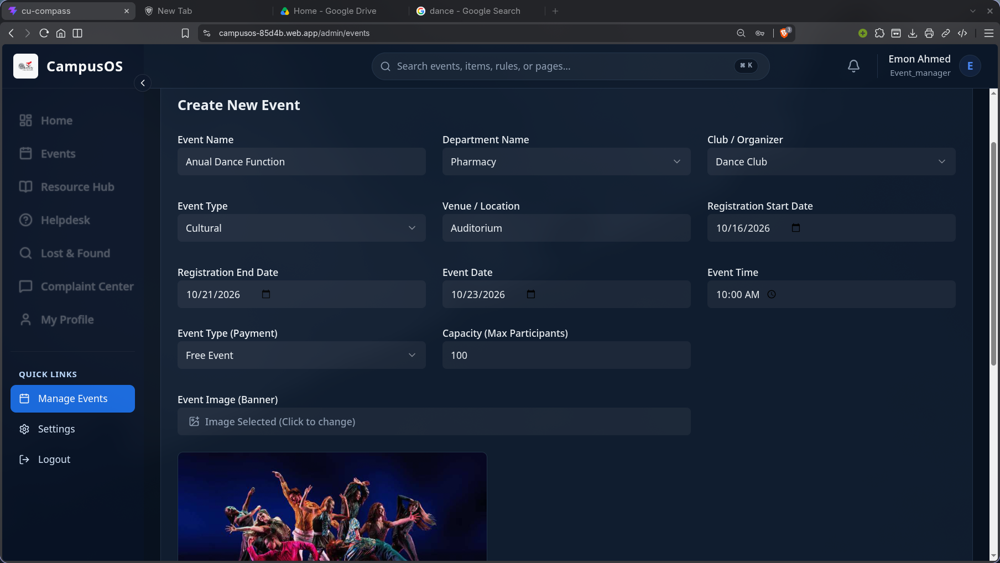
  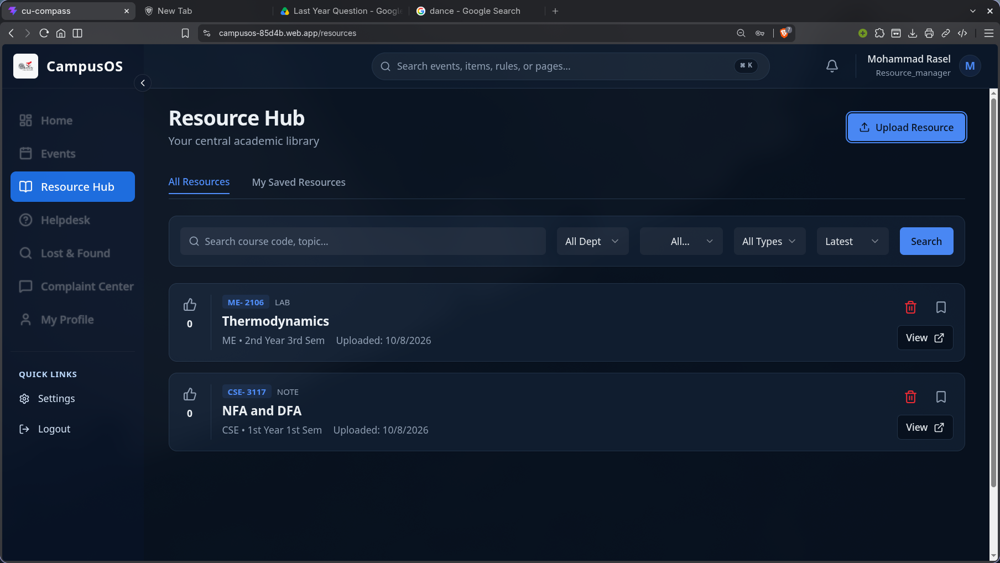
  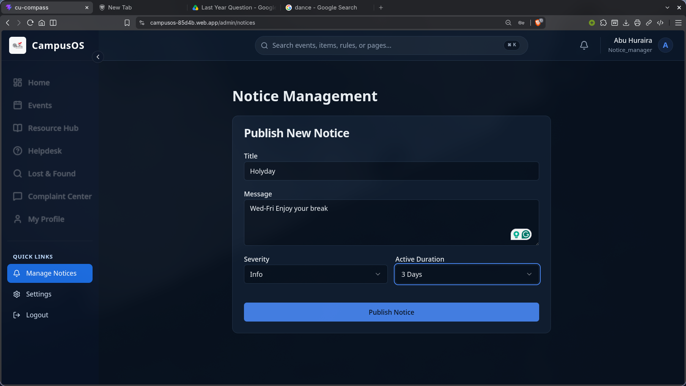
  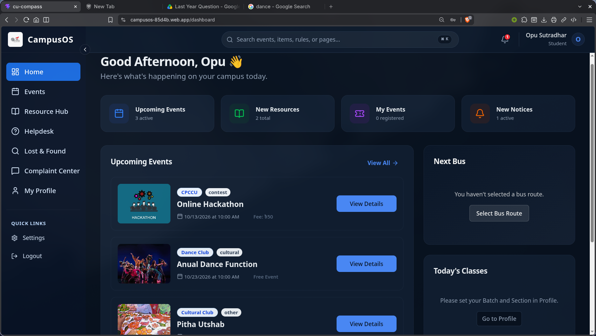
  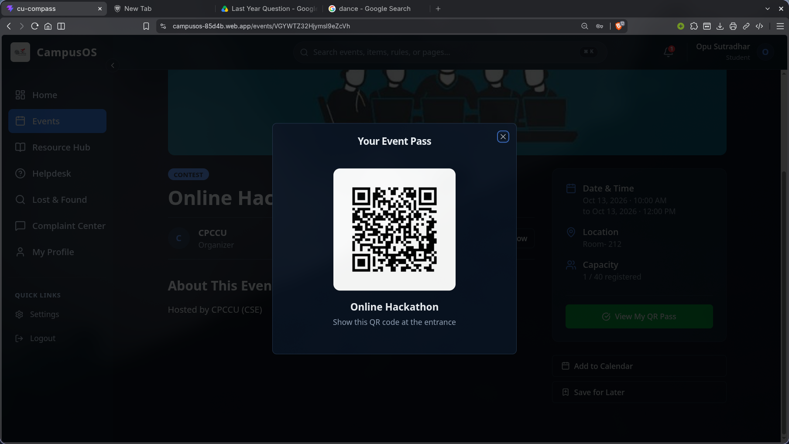
  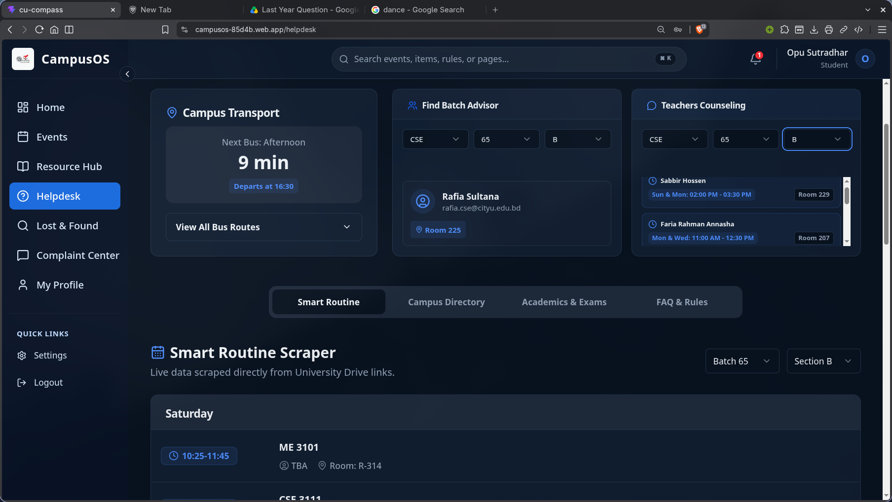
  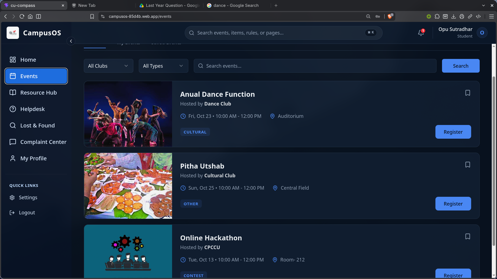
  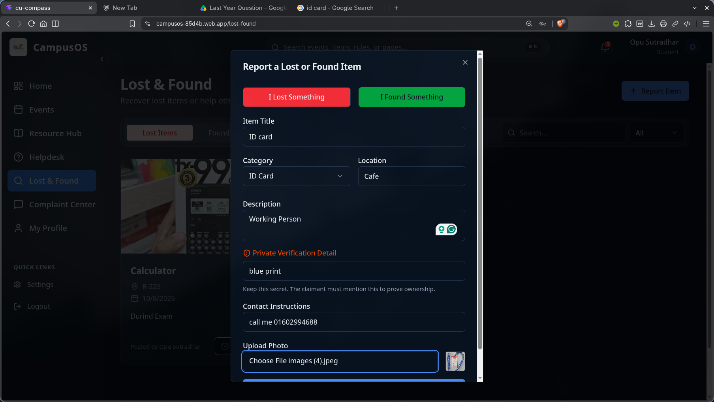
  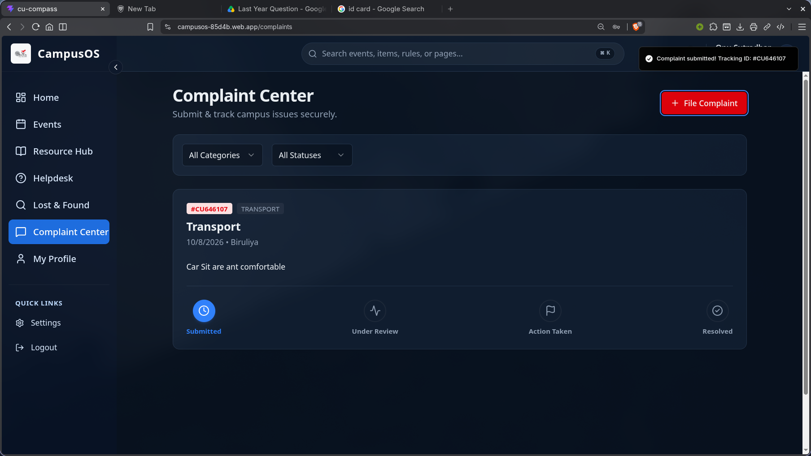
  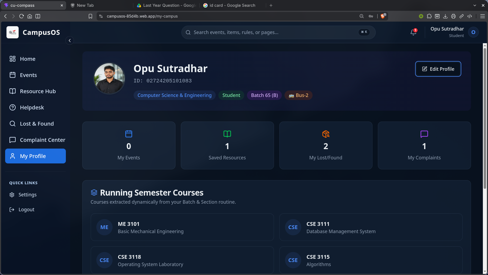
  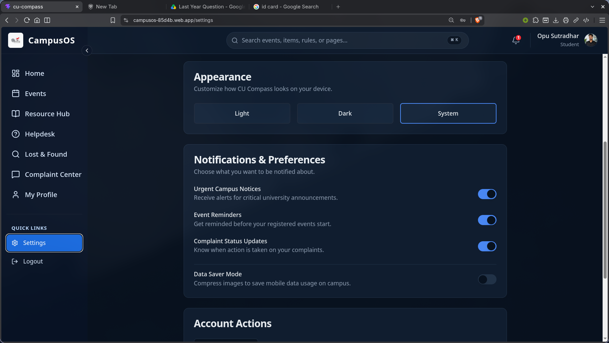
</div>
